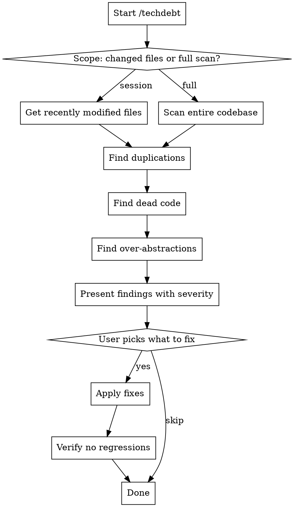

# Tech Debt Hunter

Find and kill duplicated code, dead code, and unnecessary complexity.

## When to Use

- End of coding session (run `/techdebt` before wrapping up)
- After implementing multiple related features
- When codebase feels cluttered or repetitive
- Before major refactoring to establish baseline

## Process



## What to Hunt

### 1. Duplicated Code
- Copy-pasted functions with minor variations
- Similar logic in multiple files
- Repeated patterns that should be abstracted

**Detection approach:**
- Compare function bodies for similarity
- Look for identical string literals, magic numbers
- Find parallel if/else or switch structures

### 2. Dead Code
- Unused imports
- Unreachable code paths
- Commented-out code blocks
- Functions never called
- Exports never imported

### 3. Over-Abstractions
- Single-use helpers that add indirection
- Wrapper functions that just pass through
- Abstractions for "future flexibility" never used
- Deep inheritance for simple operations

## Output Format

Present findings as a prioritized list:

```
## Tech Debt Found

### High Priority (fix now)
1. **Duplicated validation logic** in `auth.ts:45` and `api.ts:120`
   - 15 lines identical, only differ in error message
   - Suggestion: Extract to `validateRequest()` helper

### Medium Priority (consider fixing)
2. **Dead export** `formatDate` in `utils.ts:30`
   - Exported but never imported anywhere
   - Suggestion: Remove or make internal

### Low Priority (note for later)
3. **Similar patterns** in handlers `userHandler.ts`, `orderHandler.ts`
   - Could share base class but works fine as-is
```

## Execution

When user runs `/techdebt`:

1. **Determine scope**
   - Default: Files modified in current git session (`git diff --name-only HEAD~10`)
   - Full scan if user specifies or working directory is small

2. **Run analysis**
   - Use parallel agents for each category
   - Cross-reference findings to avoid duplicates

3. **Present findings**
   - Group by severity
   - Include file:line references
   - Show concrete suggestions

4. **Interactive cleanup**
   - Ask which items to address
   - Apply fixes one category at a time
   - Run tests after each batch

## Quick Commands

| Command | Description |
|---------|-------------|
| `/techdebt` | Scan session changes |
| `/techdebt full` | Scan entire codebase |
| `/techdebt --duplicates` | Only find duplications |
| `/techdebt --dead` | Only find dead code |

## Integration with Session End

Pair with `wrap-up` skill:
1. Run `/techdebt` first
2. Fix high-priority items
3. Then run wrap-up for notes

## What NOT to Report

- Style inconsistencies (leave for linters)
- Performance optimizations (different concern)
- Test code duplication (often intentional)
- Generated files
